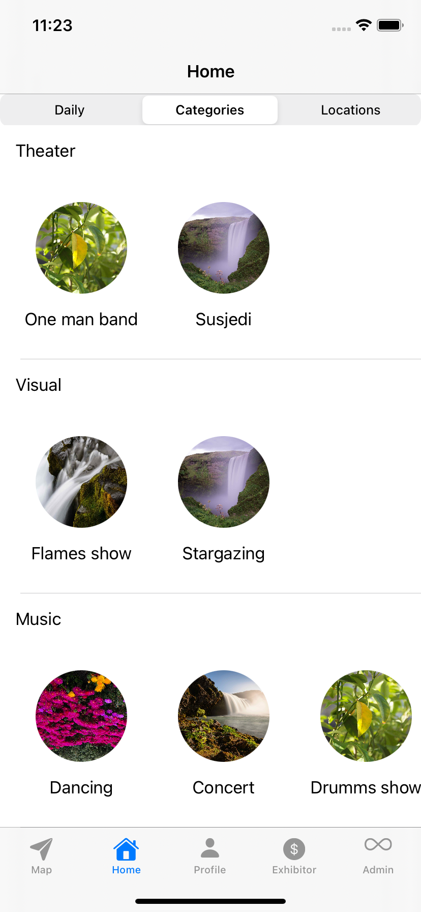
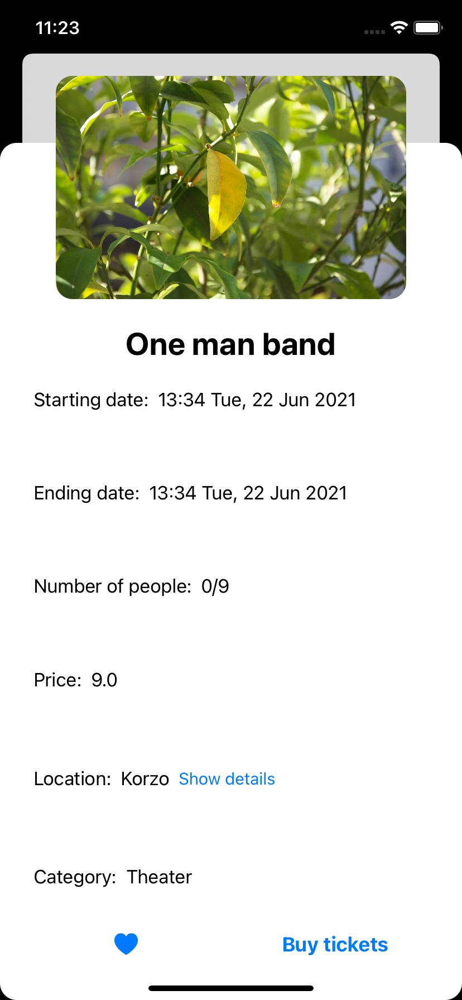
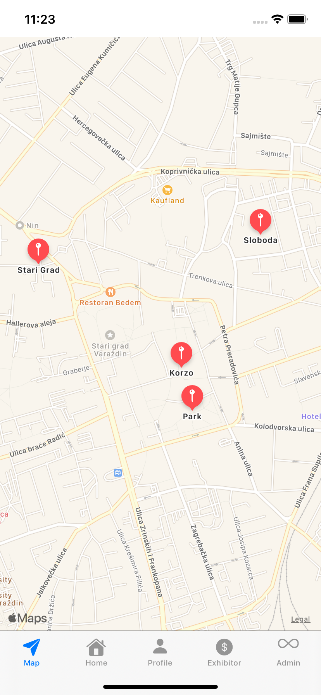
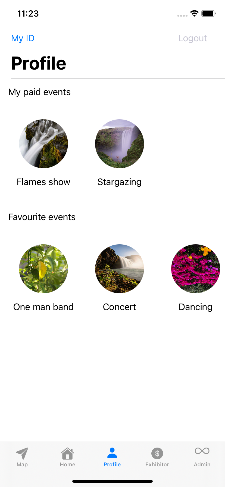
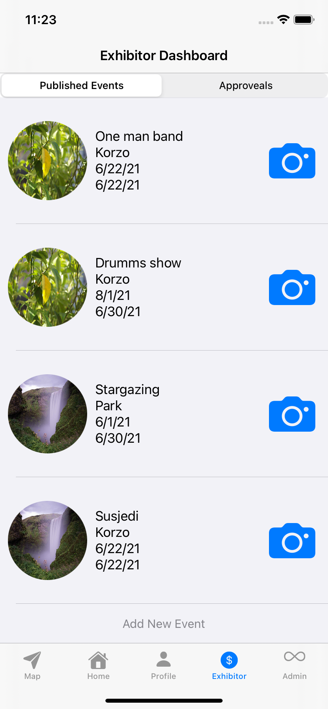
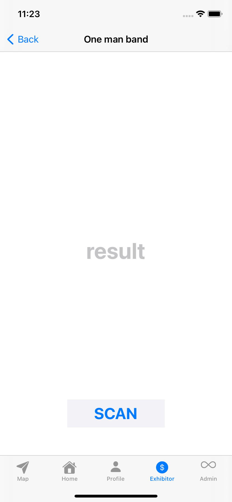
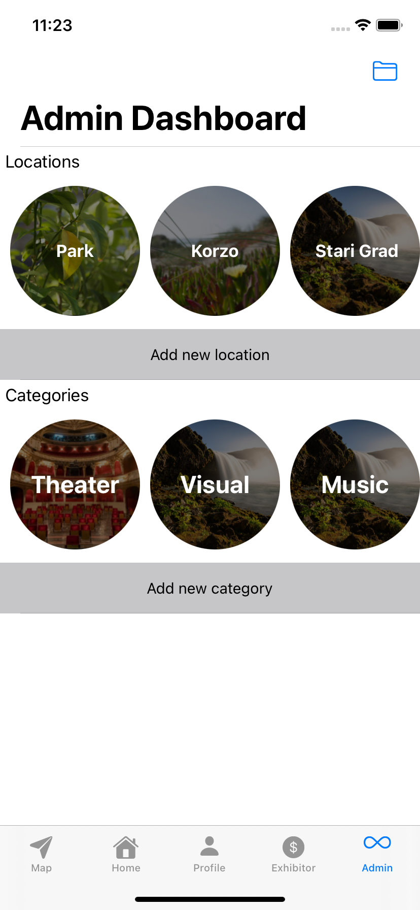
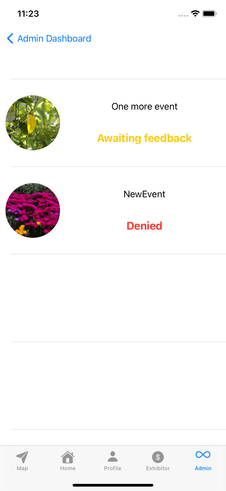

# Spancirfest

In my hometown of Varaždin, Špancirfest is main event of the year so I decided to make an app.  
The goal of the app is to allow users to see event details, follow event and buy tickets for event.  
The app has three main user types: visitor, exhibitor and admin. Every admin is exhibitor and visitor and every exhibitor is visitor. Every new account is by default visitor.  
Visitors can see events. Events are sorted by day, category or location. Tapping on any of the events, visitor can see event details (such as name, location, price, etc.), follow/unfollow event or buy tickets for event (braintree is used). Visitor can also see the map with all the locations. Tapping the location, events on that location are displayed. On profile, visitors can see their followed and paid events. On profile, visitor can also access their unique ID as barcode that can be used to verify purchase.  
Exhibitors are the heart of Špancirfest. They can be event organisers or just individuals performing their routines. Exhibitor can create event (set name, date, price, image, etc.). Every new event needs admin's approveal so exhibitor can see their approveals with admin's feedback. Every published event can be paid type. In that case, exhibitor can scan users unique QR codes with in app QR code scanner to determine if visitor bought ticket for event.  
Admin can manage locations and categories (create them, change name, photo, etc.). Admin can also see all newly created events. If event is still waiting for approveal, admin can approve or denie event and add comment about decision. If event has already been approved or denied, admin cannot change the state.
  
 
 Testing credentials:   
 Admin   
 email: dino.martan@gmail.com   
 password: 123456   
 Exhibitor   
 email: exhibitor@test.com   
 password: 123456   
 Visitor   
 email: visitor@test.com   
 password: 123456   
 
 Home
 

  
  

 Map
 

  

 Profile
 

  

 Exhibitor dashboard
 

  
  

 Admin dashboard
 

  
  

